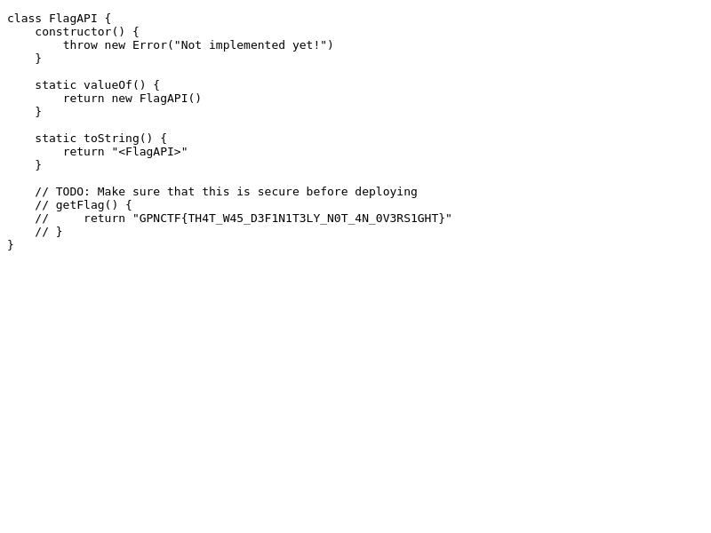

# TODO-hard

## Challenge Overview
This is a continuation of the [TODO](../todo) challenge. The main difference is at [line 56 of server.js](server.js#L56) which finds and replaces any instances of the flag in the document body with "nope". If we try our previous solution, we see that indeed we see "nope" where the flag was previously.

## Solution
Ok, so we need to find a way to bypass the check that removes the flag. Hmm, so after our input is submitted, it waits 2 seconds, then replaces instances of flag, then screenshots the page and returns it. The page is not frozen between the replacement and the screenshot, so if we can make it such that the flag is not there at the time of evaluation, but is there at the time of screenshot, we can bypass the replacement and retrieve the flag.

The first thing I tried was to delay setting the location to `script.js` by exactly 2000 milliseconds using 
```
<script>setTimeout(() => { window.location='/script.js'; }, 2000);</script>
```
and I got "internal error :( pls report to admins". Ok, so I know I broke something. Let's try to wait a little longer than 2 seconds and see if that works.
```
<script>setTimeout(() => { window.location='/script.js'; }, 2005);</script>
```
And that worked! Looks like there is a race condition between the evaluation and the screenshot.

## Flag
