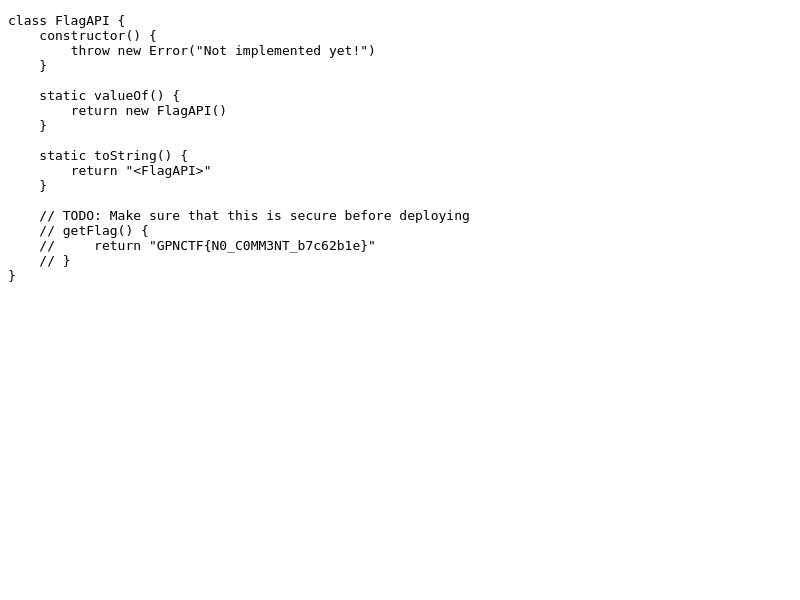

# TODO

## Challenge Overview
The website consists of two form fields, one to submit to `/chal`, and another to submit to `/admin`. 

### /chal
It looks like `/chal` is just passing the raw, unfiltered input to the HTML body and sending it back, perfect for reflected XSS. 

### /admin
`/admin` takes your input and submits it ot `/chal` on behalf of the admin, screenshots the result, and sends it back. The admin has the flag set to their cookie.

### script.js
This script doesn't really do much, but interestingly, it does have a reference to a fake flag, that is replaced only if the admin cookie is set. 

## Solution
So we just need a way to have the admin display the script with their cookie, and we will have a screenshot of the flag. One way to achieve this is to simply change the location of the window to `/script.js`. The payload I submitted in the admin field was 
```
<script>window.location='/script.js';</script>
```

## Flag

